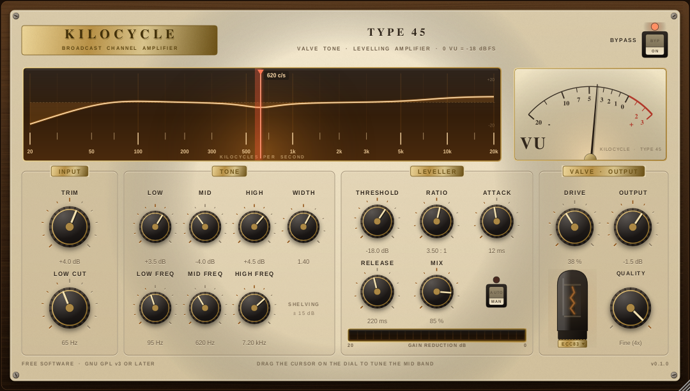

# Kilocycle

A broadcast console channel strip: input trim, a switchable low cut, a three-band
tone section, a levelling amplifier, and a very restrained valve stage. VST3 and
standalone, Windows and Linux.

The point is the sound of a signal passing through a well-kept desk — a little
firmer, a little warmer, still recognisably itself. The valve stage tops out at a
gentle glow; there is no setting that turns it into a distortion pedal.



---

## Signal flow

```
input trim → low cut → tone (low shelf / mid bell / high shelf)
           → levelling amplifier → valve stage (oversampled) → output
```

### Tone

Four RBJ bi-quads with shared coefficients and per-channel state, refreshed every
32 samples from smoothed parameter values. The low cut is 12 dB/octave and
switches out completely at its lowest position. The shelves use a wide, gentle
slope (0.75) rather than the textbook 1.0, which is what makes broadcast tone
controls feel musical instead of surgical.

### Levelling amplifier

Feed-forward, stereo-linked, soft knee (6 dB), with **program-dependent release**:
two envelopes run in parallel, one at the release time you set and one five times
slower, and the applied reduction is the larger of the two. Short transients
recover quickly, sustained loud passages keep the amplifier leaned in. That is
what stops the pumping you get from a single time constant.

Detection runs through an 85 Hz side-chain high-pass so kick drums and rumble do
not modulate the whole programme. `Comp Mix` gives you parallel compression;
`Auto Makeup` adds back a share of the reduction the static curve implies.

### Valve stage

Four things happen at once, which is what makes it read as *valve* rather than
*clipper*:

1. **Low-frequency pre-emphasis** pushes the bottom end harder into the
   non-linearity, and a complementary shelf pulls it back afterwards. Harmonic
   density in the low mids without the mix going muddy.
2. **An asymmetric curve** — the negative half compresses slightly more than the
   positive one, like a single-ended triode. The asymmetry is what gives you
   second-harmonic warmth instead of hollow odd-harmonic buzz.
3. **Supply sag** — output valves droop on sustained peaks, so the stage
   compresses itself a little. It is most of what separates an EL84 from a
   small-signal triode.
4. **A high shelf and a voicing bell afterwards**, taking the edge off the topmost
   harmonics the way an output transformer would.

The shaper blends two curves, `x / sqrt(1 + x²)` and `x / (1 + |x|)`. Both are
monotonic, infinitely differentiable and cheaper than `tanh`, and both have unity
slope at the origin — so the blend sets how long the knee is without ever
introducing a discontinuity to alias. Drive scales the input gain into the curve,
so low settings sit in the genuinely linear region. Everything runs at 2× or 4×
(`Quality`), with a DC blocker afterwards because an asymmetric curve necessarily
produces an offset.

### Swapping valves

Click the valve to pull it and fit a different one. Six types, each with its own
drive scaling, asymmetry, grid bias, knee length, bass push, tilt, voicing and
sag — and its own bottle, so a fat octal with a bakelite base looks nothing like a
slim all-glass miniature.

Every one of those model parameters is scaled by Drive. That keeps an important
property intact: **at Drive 0 all six valves are identical and the stage measures
0.00 dB.** You are choosing how the valve behaves when it is being worked, not
adding a permanent EQ curve. `KilocycleDevTool check` asserts both.

Measured with a 500 Hz tone at −6 dBFS and Drive at 100 %, harmonics relative to
the fundamental:

| valve | | level | 2nd | 3rd | 4th |
|---|---|---|---|---|---|
| ECC83 | twin triode, the studio standard | −2.6 dB | −20.0 | −15.7 | −32.3 |
| ECC88 | twin triode, fast and clean | −1.1 dB | −23.5 | −19.3 | −43.7 |
| EF86 | pentode, the broadcast microphone valve | −2.1 dB | −34.8 | −15.4 | −54.2 |
| 6SN7 | octal twin triode, large and open | −3.9 dB | −21.2 | −17.0 | −36.8 |
| 6V6 | beam tetrode, sweet and compressed | −4.4 dB | −21.8 | −14.4 | −34.7 |
| EL84 | output pentode, bright and springy | −3.4 dB | −31.5 | −13.8 | −46.4 |

The families separate the way the physics says they should. The triodes sit about
4 dB apart on even versus odd harmonics; the two pentodes are 18–19 dB
odd-dominant, which is exactly the hollower sound a symmetric transfer curve
gives you. ECC88 barely touches the signal and ECC83 is the reference; 6SN7 and
6V6 are the big warm ones; EL84 is the springy, compressed one. Make-up gain
tracks both drive scaling and sag, so A/B-ing valves compares character rather
than loudness.

Note that these are *caricatures*, tuned by ear and by the numbers above to be
recognisable — not circuit models of the real parts.

### Metering

0 VU = −18 dBFS. The needle is an average-responding movement with a real 300 ms
integration time in the DSP, plus a lightly damped spring in the GUI so it
overshoots a touch and settles — the mechanical half of the illusion.

---

## The panel

Entirely vector-drawn: wood, enamel, bakelite, brass and glass, one cached noise
tile, no binary image assets. It stays sharp at any size and the plug-in stays
small.

The **tuning dial** is a real control, not decoration. The amber trace is the live
response of the tone section across the whole audio band, and the red cursor tunes
the mid bell — drag it, scroll it, double-click to reset. Static panel artwork is
cached at the window's physical resolution, so it is a single blit per repaint no
matter how ornate it looks.

The window is resizable at a fixed aspect ratio and remembers its size in the
session.

---

## Building

Requires CMake 3.22+ and a C++17 compiler. JUCE is a pinned submodule rather than
a configure-time download, so builds are repeatable, work offline, and the exact
framework revision behind any binary is recorded in the history — which is also
what makes the GPL "corresponding source" obligation easy to satisfy.

```bash
git clone --recurse-submodules https://github.com/doctorspider42/kilocycle.git
```

If you already cloned without `--recurse-submodules`:

```bash
git submodule update --init
```

### Linux

Install the build dependencies (Debian/Ubuntu names):

```bash
sudo apt install build-essential cmake ninja-build libasound2-dev libfreetype-dev libfontconfig1-dev libx11-dev libxext-dev libxrandr-dev libxinerama-dev libxcursor-dev libxcomposite-dev libxrender-dev libgl1-mesa-dev
```

Then:

```bash
cmake -B build -G Ninja -DCMAKE_BUILD_TYPE=Release && cmake --build build
```

Artefacts land in `build/Kilocycle_artefacts/Release/`:

- `VST3/Kilocycle.vst3` — copy to `~/.vst3/`
- `Standalone/Kilocycle` — runs directly, ALSA or JACK

`-DKILOCYCLE_COPY_AFTER_BUILD=ON` (the default) installs the VST3 into `~/.vst3`
for you; pass `OFF` to keep the build self-contained.

### Windows

With Visual Studio 2022 and the Desktop C++ workload:

```
cmake -B build -G "Visual Studio 17 2022" -A x64
cmake --build build --config Release
```

The VST3 goes to `%CommonProgramFiles%\VST3` when
`KILOCYCLE_COPY_AFTER_BUILD` is on.

### Developer tool

```bash
cmake -B build -DKILOCYCLE_BUILD_TOOLS=ON && cmake --build build
build/KilocycleDevTool_artefacts/Release/KilocycleDevTool check
build/KilocycleDevTool_artefacts/Release/KilocycleDevTool shot docs/panel.png
```

`check` runs offline DSP tests — transparency at neutral settings, that the
compressor compresses, that full drive neither runs away nor blows up the peak
level, that bypass is sample-accurate against the reported latency, that silence
stays silent, that switching oversampling mid-stream is safe, that every valve is
well behaved and that they are identical at Drive 0 — then prints the harmonic
survey above and the CPU cost. `shot` renders the panel to a PNG without needing a
window (an optional third argument picks the valve), which makes both usable in
CI.

Current numbers on a desktop x86-64: latency 61 samples at 4×, and 60 seconds of
stereo at 48 kHz processed in about 2.4 seconds — roughly **4 % of one core**.

---

## Parameters

| | |
|---|---|
| Bypass | true bypass; the dry path still goes through the oversampling filters so the reported latency stays valid |
| Input Trim | −24 … +24 dB |
| Low Cut | 20 … 400 Hz, 12 dB/oct, off at the bottom of its range |
| Low / Mid / High | ±15 dB |
| Low Freq | 40 … 320 Hz (shelf) |
| Mid Freq | 180 … 6500 Hz (bell) — also on the dial |
| Mid Width | Q 0.35 … 4 |
| High Freq | 1.5 … 14 kHz (shelf) |
| Threshold | −48 … 0 dB |
| Ratio | 1:1 … 12:1 |
| Attack | 0.5 … 120 ms |
| Release | 30 … 1500 ms (with the slow second envelope derived from it) |
| Comp Mix | 0 … 100 % parallel |
| Auto Makeup | on/off |
| Valve Drive | 0 … 100 % |
| Valve | ECC83 / ECC88 / EF86 / 6SN7 / 6V6 / EL84 — click the valve on the panel |
| Quality | Eco (2× polyphase IIR) / Fine (4× linear-phase FIR) |
| Output | −24 … +12 dB |

Mono and stereo are both supported; the compressor is always stereo-linked.

---

## Licence

Kilocycle's own source is free software under the **GNU General Public License,
version 3 or later** — see [LICENSE](LICENSE).

The copyleft is not a choice, it is what the framework requires. **JUCE 8's free
licence is the AGPLv3**, so the combined work — and therefore every released
binary — additionally carries the AGPLv3 network clause. GPLv3 section 13 and
AGPLv3 section 13 each explicitly permit that combination. For a desktop plug-in
the network clause is inert; it only applies to programs users interact with
remotely, which a VST3 in a DAW is not.

Worth knowing: the VST3 SDK bundled with JUCE 8 is **MIT licensed** (© 2025
Steinberg), so the plug-in *format* imposes nothing. JUCE is the only copyleft
dependency. The DSP in `Source/dsp/` is plain C++17 with no JUCE includes,
precisely so a port to a permissive framework stays possible.

[NOTICE.md](NOTICE.md) has the full breakdown, the third-party component list and
what a redistributor has to do. Short version: **yes, the binaries may be given
away for free**, provided the corresponding source goes with them — which is what
the tagged commit plus the pinned JUCE submodule in this repository is for.

VST is a trademark of Steinberg Media Technologies GmbH, registered in Europe and
other countries.

---

## Releases

Every push builds and tests on Linux and Windows; see
[`.github/workflows/build.yml`](.github/workflows/build.yml). CI runs the same
`KilocycleDevTool check` suite as above and renders the panel headlessly, so a
broken editor fails the build rather than shipping.

There are two kinds of download:

**[Latest dev build](../../releases/tag/dev)** — every green push to `main`
replaces a rolling `dev` prerelease, so there is always a current binary. The
panel footer shows the commit it was built from (`v0.1.0 · a1b2c3d`) and
`BUILD-INFO.txt` names both that commit and the exact JUCE revision. These builds
pass CI but have not been opened in a host, which is the whole reason they are
marked prerelease.

**Tagged releases** — pushing a `v*` tag produces a *draft* release instead, so
the notes and the binaries get a human read before anyone downloads them:

```bash
git tag -a v0.1.0 -m "Kilocycle 0.1.0" && git push origin v0.1.0
```

Both kinds ship a Linux `.tar.gz` and a Windows `.zip` containing the VST3, the
standalone, both licence texts and the notices.
